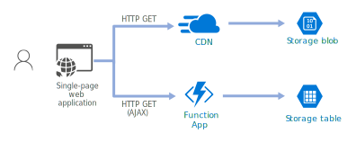

# librian会所的后端

基于 Serverless (Azure Functions) 的后端。

Serverless真是太棒了！

## 相关内容
    
+ 网站  
    <https://center.librian.it/>

+ 前端  
    <https://github.com/librian-center/librian-center-frontend>

## 体系结构

这个仓库只包含 Function App 的代码。

## 使用方法

我也说不清楚要装什么，总之参阅 [微软的文档](https://docs.microsoft.com/zh-cn/azure/azure-functions/functions-create-first-azure-function-azure-cli?tabs=bash%2Cbrowser&pivots=programming-language-python) 就行了。

